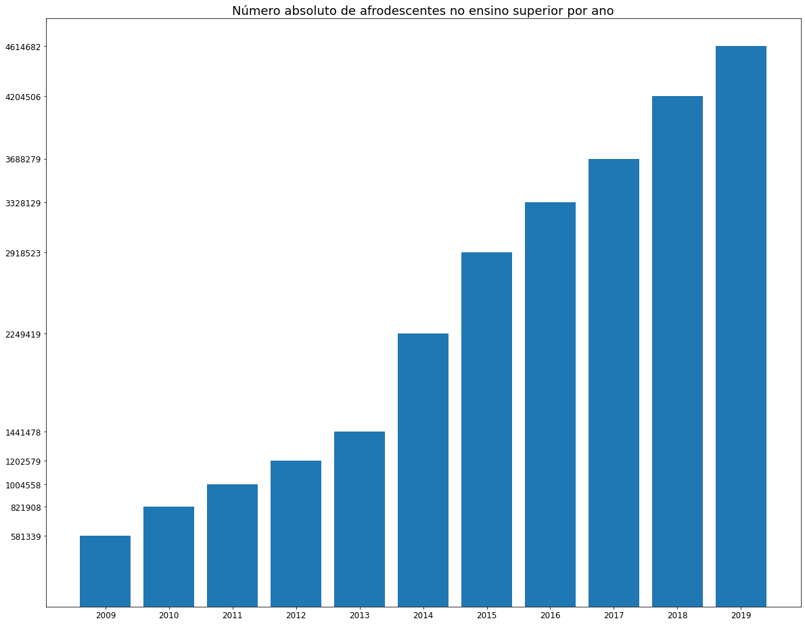
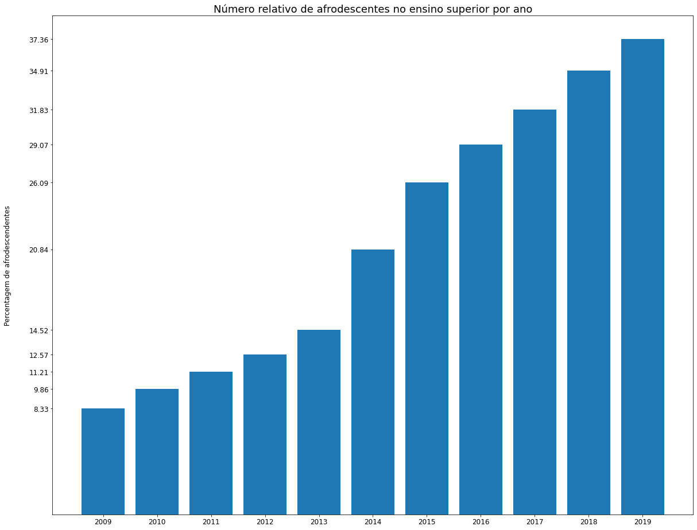
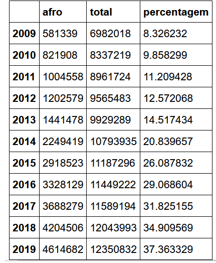
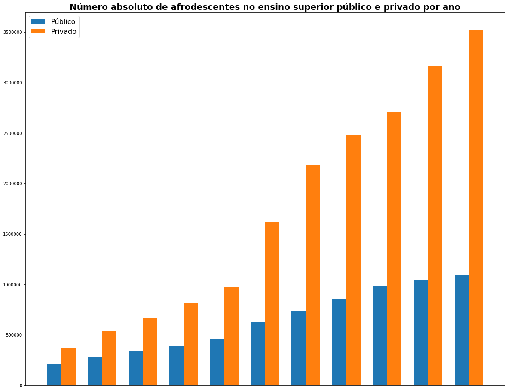
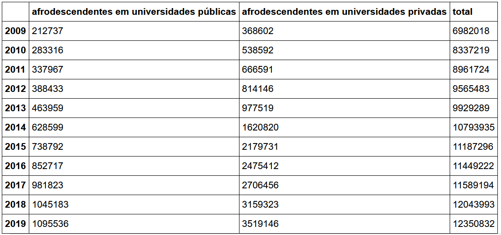
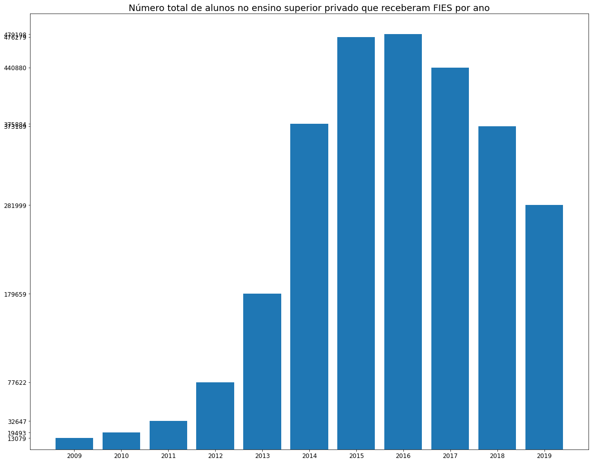
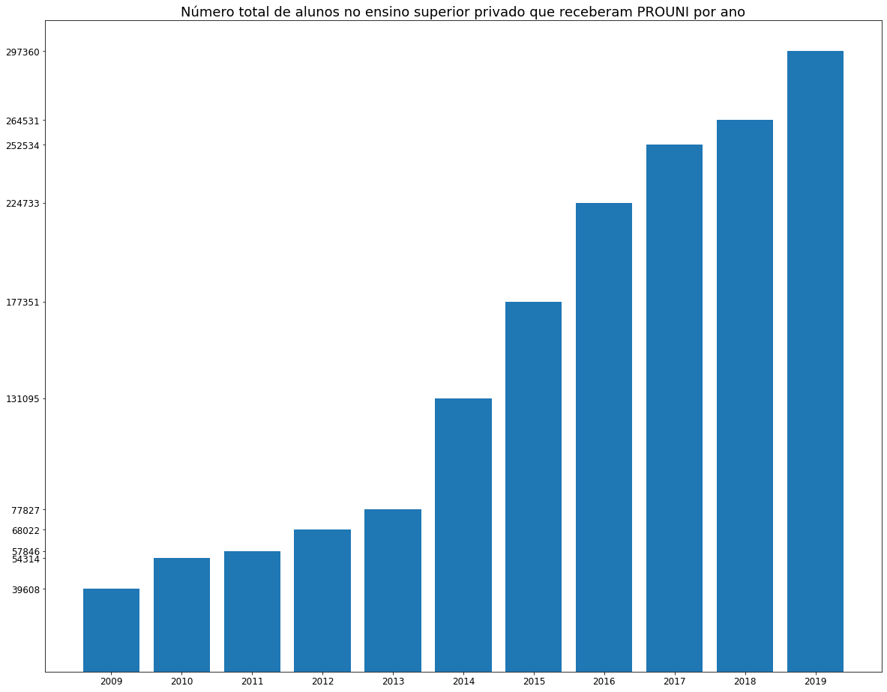
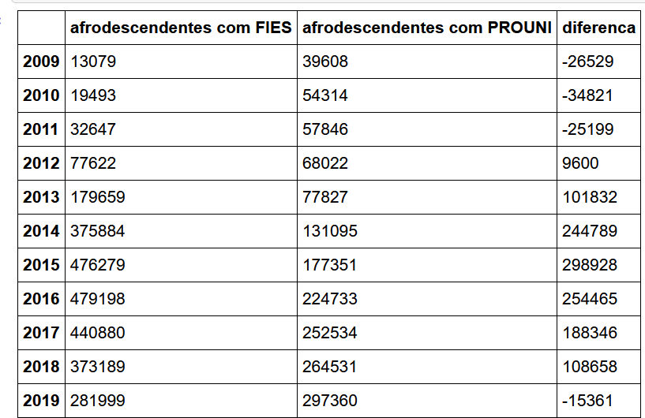

# Política-Racial-no-Ensino-Superior-2009-2019

Esse projeto foi desenvolvido como parte de um desafio técnico
O objetivo era analisar os dados de ensino superior disponíveis na base de dados do Ministério do ensino superior, MEC, por meio do questionário do censo da educação superior.
O lapso temporal a ser analisado é entre 2009 e 2019.

# Desafio Técnico Sigalei

O racismo estrutural é um problema histórico que foi evidenciado neste ano de 2020 por diversos fatos marcantes. Entre eles, o crescimento exponencial do movimento Black Lives Matter (Vidas negras importam), que expandiu pelo mundo todo, inclusive no Brasil.

Para combater o racismo, existem diversas iniciativas, dentre elas, as cotas raciais. As cotas aceleram o processo de permitir o acesso a oportunidades que devido, à estrutura sistemática, é distante da realidade de grande parte da população negra do país, que constitui cerca de 56% dos brasileiros, segundo o IBGE.

As primeiras cotas universitárias foram implementadas ainda no governo Lula em 2009, ou seja, há mais de 10 anos, sendo que, ao longo desses anos e das mudanças de governo, a adesão de instituições públicas de ensino superior a esse sistema também se modificou.

O objetivo desse desafio é coletar, transformar e armazenar os dados do censo universitário desde 2009 até 2019 em uma base da sua preferência para analisar os impactos dessa política pública no perfil do universitário brasileiro ao longo dos últimos 11 anos.

Objetivos: Coletar e armazenar os dados do censo universitário em uma base da sua preferência; Analisar o impacto da presença de pretos e pardos no curso superior

## Dados

Os dados que você irá utilizar são os microdados disponibilizados nesse site: https://www.gov.br/inep/pt-br/areas-de-atuacao/pesquisas-estatisticas-e-indicadores/censo-da-educacao-superior/resultados?_authenticator=73b6b0e03f10cadf5ec8ab8e09e6be4f931e571f

## Bibliotescas usadas
-pandas
-glob
-os
-dask
-numpy
-matplotlib

## Desafios
Dois desafios principais existiram nessa análise. Primeiramente os dados estão separados em arquivos .csv por ano que não necessariamente mantêm um padrão de colunas. Além disso
a quantidade de dados inviabiliza a leitura direta dos dados em uma máquina comum utilizando Pandas.
O primeiro problema demandou uma análise exploratória que permitiu definir as colunas de interesse e suas correspondências ano a ano.
O segundo foi solucionado utilizando a biblioteca Dask. Outras soluções poderiam ser implementadas, notadamente a criação de um banco de dados. Mas pelo tempo exíguo a utilização
da biblioteca Dask me pareceu mais adequada.

# Análise

O foco do projeto era uma análise exploratória focada na questão racial (pretos e pardos). Dessa maneira o primeiro passo da análise foi separar os dados dos indivíduos
que se autodeclaram afrodescendentes. Feita essa separação temos a seguinte distribuição:

Como podemos ver há uma crecente no número de alunos afrodescendentes em todo o período.
Esse crescimento pode se dever tanto ao crescimento de vagas quanto à maior proporção de afrodescendentes no ensino superior, vamos analisar:

Podemos verificar que realmente há uma maior concentração de alunos afrodescendentes no ensino superior. Esse movimento é crescente ano a ano e atinge o pico de 37,36% em 2019.
Vamos ver o número absoluto desses alunos.

Há uma entrada constante de alunos afrodescendentes no ensino superior. Mas esses alunos estão entrando em universidades públicas ou privadas?
Primeiramente separarei os dataframes com afrodescendentes em universidades públicas e privadas. Após isso criarei uma lista com os totais para cada uma dessas categorias.

Fica claro que há uma crescente tanto de alunos afrodescendentes em universidades privadas e públicas.
Apesar disso, o crescimento relativo entre 2009 e 209 nas universidades privadas é muito maior do que nas públicas: 954% ante 514%
Essa diferença poderia advir de estudantes que não terminam os cursos. Assim vamos analisar os alunos ingressantes:

Vemos então que há realmente uma maior entrada de alunos afrodescendentes no ensino superior, principalmente no setor privado.
Esse aumento de alunos no setor privado provavelmente é explicado pelas políticas públicas de financiamento estudantil.
As duas principais são o FIES e o PROUNI, vamos verificar como essas políticas influenciam esse padrão

